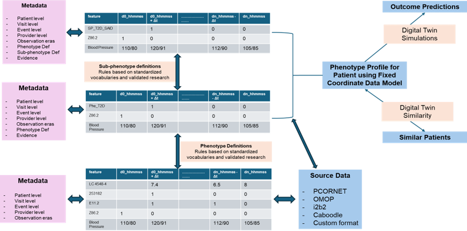

## Statement of the problem

Electronic Health Records (EHR) contains a trove of information that can deepen the current understanding of patient health history and predicting future trajectory. Given the recent advancements in curation of common data models, coupled with availability of large-scale computing resources, the complexity of analyzing longitudinal data has been reduced. A current limitation is the variability of patient histories across different time scales and clinical contexts, which adds friction for the process of direct comparison. This project proposes a fixed coordinate system for EHR representation that aligns patient trajectories for mapping clinically relevant data in a deterministic manner, and aims to address the current bottleneck.

For this project’s scope, I will be focusing on Acute Kidney Injury (AKI), a serious condition propelled by rapid deterioration of kidney function. It is a common occurrence among ambulatory and hospitalized patients \[1\] and can lead to elevated morbidity, and in some cases, mortality, along with increased medical costs. Since clinical progression of AKI is dependent on the patient’s health history, treatments and interventions and biological responses, transformation into a fixed coordinate system can help narrow down the features and time frame, while also maintaining data accessibility for manual review, if necessary.

```{=html}
<!--


Figure 1. General workflow for a Fixed-Coordinate System towards Prediction Applications 
-->
```

## Tasks to be accomplished

-   Curate a fixed coordinate system for AKI patient trajectories using OMOP Common Data Model
-   Transform patient histories into vectors in the coordinate space
-   Train models to predict AKI onset and evaluate model performance
-   Explainability analysis to identify key features and time points that contribute to AKI progression

```{=html}
<!--
- Use an optimal model to construct a prototype framework to match similar patients, and/or predicting future health trajectory for the patient 
-->
```

## Dataset to be used

-   Fully deidentified [OMOP Dataset](https://idr.ufhealth.org/research-services/omop/covid-19-patient-dataset/) from UF Health IDR for COVID patients

-   The dataset consists of COVID-19 positive patients in UF Health EHR, and their records transformed into OMOP Common Data Model

-   The following OMOP CDM tables will be primarily used-

    -   person
    -   condition_occurrence
    -   drug_exposure
    -   measurement
    -   procedure_occurrence
    -   visit_occurrence

-   Additional tables may also be used if required

## Approach/Method

-   The AKI patients will be identified using the [KDIGO criteria](https://kdigo.org/wp-content/uploads/2016/10/KDIGO-2012-AKI-Guideline-English.pdf), primarily based on serum creatinine measurements and urine output.

-   The fixed coordinate system will represent the patient trajectory in a 2D space with temporal dimension and clinical context dimension.

-   The clinical context features will include the following:

    -   Demographics
    -   Lab Measurements
    -   Comorbidities
    -   Medications
    -   Procedures

-   Each patient i will be represented by a feature vector

    ${x}_i$ = $(x_{i1}$, $x_{i2}$, $....$, $x_{id}$)

    where $d$ are the number of features and $x_{ij}$ represents value of feature $j$ for patient $i$

-   The aim is to create a fixed coordinate mapping function

    $f$:$R$$^d$ $\rightarrow$ $R^k$

    where $k$ \< $d$ and $f$(x) is the fixed coordinate representation of a patient

-   Another key parameter of interest is the size of the time grid i.e. the length of the time interval bucket. For this project, a 1-day time grid will be used i.e. the patient trajectory will be represented in 1-day intervals. The primary reason of using day and not hour-based time grid is because KDIGO criteria for AKI is based on the following criteria-

    $SCr_{t}$ - $SCr_{baseline}$ $\geq$ 0.3 mg/dl within 48 hours

    **OR** <!--
      $SCr_{t}$ / $SCr_{baseline}$ $\geq$ 1.5 within 7 days
    -->

    $\frac{SCr_{t}}{SCr_{baseline}}$ $\geq$ 1.5 within 7 days

    Hence, a 1-day time grid will be sufficient to capture the temporal dynamics of AKI progression

-   Machine Learning: The project will construct a model zoo - a group of different models to be trained and compared for our dataset. We will use the models below-

    -   **Random Forest** - Builds decision trees for the dataset and averges the predictions
    -   **Logistic Regression** - predicts probabilites by fitting a straight-line decision boundary and passing the results to a sigmoid curve
    -   **XGBoost** - gradient boosting model that builds trees one-by-one, each correcting errors of the previous tree, generally known for high accuracy
    -   **LGBM** - gradient boosting model, optimized for speed, especially on large datasets. Uses histogram-based splits
    -   **MLP** - Mutli-layer perceptron (feedforward neural network) is useful for complex non-limear relationships

-   **If feasible under project constraints** - a prototype framework will be constructed to match similar patients based on their fixed coordinate representation, and/or predicting future health trajectory for the patient

## Experiment and Evaluation Plan

-   The model will be evaluated using n-fold cross validation and with the following metrics
    -   **Precision**: For all the times model predicted '1', how many times it was actually '1'

    -   **Recall**: For all the values '1' in the data, how many did the model correctly classify

    -   **F-1 Score**: Mathematically, it is the harmonic mean of precision and recall. A higher F1 is better for imbalanced datasets since it represents good precision and good recall

    -   **AUROC**: ROC curve how well the model separates 0 and 1 classes - higher the better

    -   **AUPRC**: Measures how precision and recall trade off across different threshold settings. High AUPRC identifies positives well with less false alarms; Low AUPRC struggles to detect real positives
-   Explainability analysis will be performed using SHAP (SHapley Additive exPlanations) values to evaluate each contribution, to understand which features and time points are most significant in prediction AKI

## References

1.  Kellum, J.A., Romagnani, P., Ashuntantang, G. et al. Acute kidney injury. Nat Rev Dis Primers 7, 52 (2021). https://doi.org/10.1038/s41572-021-00284-z

2.  Okusa MD, Davenport A. Reading between the (guide)lines--the KDIGO practice guideline on acute kidney injury in the individual patient. Kidney Int. 2014;85(1):39-48. doi:10.1038/ki.2013.378

```{=html}
<!--
Created using **Quarto**[^1]

[^1]: The document is created using Quarto, a scientific and technical publishing system built on Pandoc. For more information, see https://quarto.org.
-->
```

------------------------------------------------------------------------

The document is created using Quarto, a scientific and technical publishing system built on Pandoc. For more information, see [Quarto](https://quarto.org).
