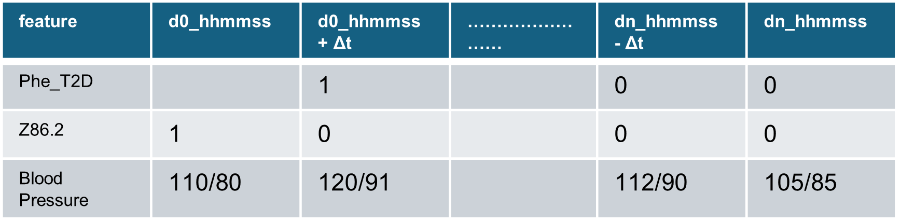
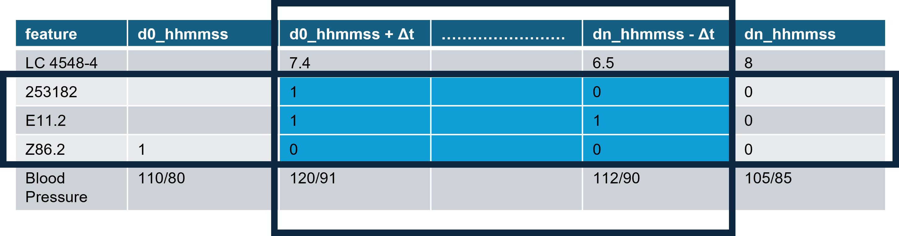
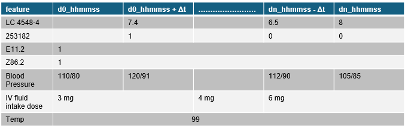



## Introduction and Background

### Electronic Health Records

Electronic Health Records (EHR) contains a trove of information that can deepen the current understanding of patient health history and predicting future trajectory. Given the recent advancements in curation of common data models, coupled with availability of large-scale computing resources, the complexity of analyzing longitudinal data has been reduced.

Electronic Health Records capture the following domains-

-   Diagnoses
-   Procedures
-   Medications
-   Labs
-   Visit Details
-   Patient reported outcomes

and much more. The data generated are natively longitudinal and heterogeneous, which makes me easily transferable for use in machine learning (ML) for prediction, phenotyping methods and personalized medicine.

### Feature-Based Learning in Healthcare

Traditional ML methods use a feature-based representation as an input, where patient history is aggregated and flattened into fixed-length vectors. These approaches are very effective on cleaner datasets, but they negate the temporal ordering and fine-grained health event dynamics. A major limitation is the variability of patient histories across different time scales and clinical contexts, which adds friction for the process of direct comparison.

Common Data Models (CDM) have become very popular recently. CDM are a standardized, unified framework of schemas, definitions, and relationships designed to make data uniform across different systems and applications. Most of the current retrosepctive, observational studies use EHR transformed into CDM like [PCORNET](https://pcornet.org/data/common-data-model/), [OMOP](https://www.ohdsi.org/data-standardization/), [i2b2](https://www.i2b2.org), etc. While CDM helps reducing the sunk cost of data cleaning for every task, the extensive standardization and transformation leads to the loss of valuable clinical insights. For e.g.

-   PCORNET CDM doesn't have a direct way to identify **ICU** stays, clinical measurements from flowsheets, etc.

-   OMOP CDM has a robust concept set for mapping, but currently doesn't have a way to map **Telephone** encounters distinctly in patient history

While the overall significance of CDMs can't be discounted, their transformed format makes the representation very different than how EHR is featured and represented, and this adds a significant friction in implementing prediction models in Clinical Decision Support Systems. In addition to that, their use in a traditional ML model needs them to be additionally transformed as feature matrices. This approach is suitable only if ML models are intended to work in silos, which is generally not their final goal. Making the model input representation so disjointed from their EHR representation leads to friction with clinical validation at the design stage.

#### Advantages:

-   Works well with sparse data
-   Interpretable
-   Robust with small datasets

#### Limitations:

-   Ignores temporal ordering
-   Cannot model event sequences

### Tensor-based sequence models

Recent advances in deep learning propose tensor-based sequence models, where patient histories are represented as time-indexed sequences. These models aim to capture temporal dependencies and enable applications such as:

-   Patient trajectory modeling
-   Similarity-based cohort discovery
-   Digital twin simulation

Tensor-based representation can be used in an attempt to learn:

-   Temporal dependencies
-   Event progression patterns



## Problem Statement

This project proposes a fixed coordinate system for EHR representation that aligns patient trajectories for mapping clinically relevant data in a deterministic manner, and aims to address the current bottleneck. It explores both paradigms by building a fixed-coordinate temporal representation of patient health using OMOP-formatted data, and evaluates:

-   Feature-based models (Logistic Regression, Random Forest, XGBoost)
-   Tensor-based sequence model (GRU)

The project is designed at a proof-of-concept level to study the feasibility of representing the EHR in a human health history sequence format.



## Data and Modelling Sources

### Data Source - OMOP CDM

The Observational Medical Outcomes Partnership (OMOP) Common Data Model (CDM) was developed by the Observational Health Data Sciences and Informatics (OHDSI) collaborative to standardize observational healthcare data. The model provides:

-   **Standardized vocabulary**: Unified concept identifiers across terminologies (ICD, SNOMED, RxNorm, LOINC)
-   **Consistent schema**: Predefined tables and relationships
-   **Reproducibility**: Enables multi-site studies without data sharing
-   **Scalability**: Used by hundreds of healthcare organizations globally

For the purpose of this project, the fully deidentified [OMOP Dataset](https://idr.ufhealth.org/research-services/omop/covid-19-patient-dataset/) from UF Health IDR for COVID patients is used.

-   The dataset consists of COVID-19 positive patients in UF Health EHR, and their records transformed into OMOP Common Data Model

-   The date range for the dataset is 2020 - current.

-   The following OMOP CDM tables will be primarily used-

    -   person
    -   condition_occurrence
    -   drug_exposure
    -   measurement
    -   procedure_occurrence
    -   visit_occurrence

-   The **main reasons** for using the above dataset was because it was

    -   pre-curated
    -   available at no cost
    -   readily available to use

### Modelling - Traditional feature-based Machine Learning Models

-   **Logistic Regression**

    -   Linear decision boundary
    -   Probabilistic interpretation
    -   Regularization (L1/L2) prevents overfitting
    -   Fast inference

-   **Random Forest**

    -   Ensemble of decision trees
    -   Handles non-linearity and interactions
    -   Feature importance via Gini impurity
    -   Resistant to overfitting through bagging

-   **XGBoost (Extreme Gradient Boosting)**

    -   Sequential tree building with gradient boosting
    -   Regularization terms in objective function
    -   Handles missing values naturally
    -   State-of-art performance on tabular data

### Modelling - Tensor-based Sequence Models

Tensor-based approaches represent patient data as multi-dimensional arrays:

-   **Temporal modeling** : Explicitly captures event order and timing

-   **Automatic feature learning** : No manual engineering required

-   **Flexible representations** : Learned embeddings adapt to data

-   **Transfer learning** : Pre-trained models can be fine-tuned

-   **Rich applications** : Enables similarity search, generation, and simulation



## Methods

### Fixed Coordinate Temporal Model

-   A fixed coordinate system for EHR representation can align patient trajectories for mapping clinically relevant data in a deterministic manner

-   Each patient will be represented as a point in a shared coordinate space

$$
Health Coordinate = z(t) \in R^d
$$

where $z$ are the physiological coordinates, $t$ is time since birth and $R^d$ represents d-Dimension real space

-   The health history of each patients becomes a **sequence** from birth -\> present -\> future

{fig-align="bottom" group="my-gallery2"}

#### Inspiration

-   Genomic data is already structured as a fixed coordinate index on genomes
-   For e.g. Mutation at chromosome *a*, postion *b* means the same for **everyone**
-   This helps direct comparision across individuals and ML at scale
-   Mathematically, each genome is represented as a vector in shared space

$$
g \in {A,C,G,T}^n
$$

-   Genomic data, however, doesn't support trajectories, since it is mostly static

#### Salient Features

A patient's health history would begin from their birth, which for the comprehensive representation will be denoted as **index event**. All the following clinical events (diagnosis, procedures, medications, labs, vitals, etc.) will then be mapped on a temporal axis of time since birth. The temporal axis would be set up in a **number of days** : **time** format, which would allow for mapping more granular domains as needed like inpatient vitals, lab results, pain scores, etc. and a time difference can be calculated between two successive measurements if required.

The proposed data model would serve as a foundation, much like EHR, for clinical researchers and data scientists to build upon as per their requirements. For e.g., in Figure 2, you can see a representation of how the base layer tensor will look for a patient

{.lightbox group="my-gallery2" fig-alt="Fixed Coordinate Temporal Data Model - Base Layer"}

Figure 3 and 4 shows how domains can be easily bucketed into computable phenotype and sub-phenotypes with this foundation layer. This not only preserve the native structure of EHR but allows the user to build a layer (in this case, phenotype) for their specific use in a research project. If needing clinical validation, the foundation elements can be reviewed within the same tensor structure. This will allow for identification of phenotypic event rather than flatten a phenotype definition on patient level.

{.lightbox group="my-gallery2" fig-alt="Fixed Coordinate Temporal Data Model - Example Phenotype Layer"}

{.lightbox group="my-gallery2" fig-alt="ixed Coordinate Temporal Data Model - Example Subphenotype Layer"}

**Splicing** and **Time Binning** are the addiitonal features that can add a layer of necessary customization to the data model.

-   **Splicing** : Most of the observational aims identify an index event, primarily calculated with a combination of diagnosis, procedure, measurement, etc. and then construct a part of the patient history around it. The proposed data model allows that more readily than CDM - since the temporal axis is designed as a time difference related to other points on the axis, it is easy to splice a section of patient history tensor, as shown in Figure 5.

{.lightbox group="my-gallery2" fig-alt="Fixed Coordinate Temporal Data Model - Splicing Example"}

-   **Time-binning** : Not all the data domains require a granularity of datetime based bins. For e.g., if we are looking to identify patients who fulfill the KDIGO criteria for AKI prognosis, it needs the following

    $SCr_{t}$ - $SCr_{baseline}$ $\geq$ 0.3 mg/dl within 48 hours

    **OR** <!--
      $SCr_{t}$ / $SCr_{baseline}$ $\geq$ 1.5 within 7 days
    -->

    $\frac{SCr_{t}}{SCr_{baseline}}$ $\geq$ 1.5 within 7 days

For this task, a 1-day time grid can be used i.e. the patient trajectory will be represented in 1-day intervals. It will be sufficient to capture the temporal dynamics of AKI progression.

Additionally, for patient history similarity comparison, it will be very rare for patients to have a similar history granular to the dattime level. Adaptive time binning can be a good tool there - for different data domains, you can employ different time binning per requirement. In Figure 6, you can see the diagnosis and temperature only operature in 1 time bin across the matrix, whereas the size of time bin for IV fluid dose is twice that of other elements- any operator (mean/avg/min/max) can be applied to the values to normalize over the time bin.

{.lightbox group="my-gallery2" fig-alt="Fixed Coordinate Temporal Data Model - Time Binning Example"}

**Handling Missing Values**:

A key challenge in fixed-coordinate systems based on time is data sparsity where most patients will have limited observations relative to the full temporal grid, depending on their age and healthcare utilization. To address this, we implemented a Coordinate Sparse Matrix representation to store patient-level data efficiently, reducing storage and computational overhead. For compute-intensive operations (e.g., matrix transformations, ML embedding generation), this structure will be converted dynamically into Compressed Sparse Row format, enabling optimized access and processing while maintaining temporal alignment.

**Patient-level and Visit-level features**:

The proposed data model will integrate patient-level and visit-level features directly into the temporal feature-matrix from the source CDM layer.

**Patient-level features** (e.g., demographics, baseline conditions) will populate static fields that remain constant throughout the observation period.

**Visit-level features** (e.g., vitals, lab results, procedures) will be dynamically appended along the time axis corresponding to each event or encounter window.

Metadata domains will capture non-temporal entities such as patient-level characteristics, phenotype definitions, code mappings, and feature hierarchies to maintain compatibility with standard vocabularies. FCT-CDM will be designed for interoperability, ensuring that existing CDM-based workflows can be extended or integrated with minimal adaptation.

### Initial Framework

-   The AKI patients will be identified using the [KDIGO criteria](https://kdigo.org/wp-content/uploads/2016/10/KDIGO-2012-AKI-Guideline-English.pdf), primarily based on serum creatinine measurements and urine output.

-   The fixed coordinate system will represent the patient trajectory in a 2D space with temporal dimension and clinical context dimension.

-   The clinical context features will include the following:

    -   Demographics
    -   Lab Measurements
    -   Comorbidities
    -   Medications
    -   Procedures

-   Machine Learning: The project will construct a model zoo - a group of different models to be trained and compared for our dataset. We will use the models below-

    -   **Random Forest** - Builds decision trees for the dataset and averges the predictions
    -   **Logistic Regression** - predicts probabilites by fitting a straight-line decision boundary and passing the results to a sigmoid curve
    -   **XGBoost** - gradient boosting model that builds trees one-by-one, each correcting errors of the previous tree, generally known for high accuracy
    -   **LGBM** - gradient boosting model, optimized for speed, especially on large datasets. Uses histogram-based splits
    -   **MLP** - Mutli-layer perceptron (feedforward neural network) is useful for complex non-limear relationships

A similar approach would have been applied to Type II Diabetes, another important condition of interest in the inital framework of this composite project. The idea was to model one rapidly progressing condition (AKI) and another chronic (Type 2 Diabetes) to see the performance of data model on machine learning tasks and its robustness.

To negate the impact of COVID, we planned to only consider data prior to 2020 for this approach i.e. 2012-2019.

### Limitations with the Dataset

-   The [OMOP Dataset](https://idr.ufhealth.org/research-services/omop/covid-19-patient-dataset/) from UF Health IDR for COVID patients mentions that it consists of the entire clinical history of any patient diagnosed with COVID-19 per the documentation.

-   In practice, the dataset has been censored before 2020 and hence only consists of records from 2020 onwards, as noticed during the analysis. Hence, we could not proceed with our initial framework.

### Modified framework after pivoting

-   Due to the presence of extremely limited data points for the patients, and a niche patient group (any patient with a COVID-19 diagnosis), we updated our study goal.

-   As mentioned above, we worked on showing the feasibility of transformation and representation of EHR into a temporal fixed-coordinate data model

-   After observing that the data we have is very limited and skewed against being able to create patient clinical history sequence, we pivoted to identify the limitations of the proposed model i.e. what are the potential scenarios where this model will perform worse compared to the traditional ML methods

#### Key Design Decisions

**Temporal Split** - Data before the index date are treated as features

-   Date after the index date are treated as labels

-   Prevents leakage

-   *Challenging since data was 2020 onwards*

**Cohort Balance** - Balanced case-control in training

**Sub-Sample: 500 patients**

-   Due to resource intensiveness, the final analysis is done on 500 patients to establish proof of concept

-   Controlled computational complexity reduced

**Time Binning** - Discrete event sequences for stability

#### Temporal Windowing and Tensor Construction

To define a clinically meaningful and temporally consistent prediction task, we constructed patient-level sequences using a fixed observation and outcome window centered around COVID-19 diagnosis.

##### Index Event

For each patient, the index date $T_{0}$ was defined as the earliest recorded COVID-19 diagnosis or COVID-related visit in the OMOP dataset. All temporal relationships were anchored relative to this index event.

##### Observation Window (Input Features)

The input sequence for each patient was constructed using events occurring within a limited pre-index window, consisting of:

-   All available clinical events prior to the COVID index date ($T_{0}$), subject to data availability
-   Events include:
    -   conditions
    -   drug exposures
    -   procedures
    -   measurements
    -   visits

Due to the nature of the dataset (COVID-only cohort starting in 2020), the pre-index history is relatively short and sparse, reflecting limited longitudinal information before infection.

##### Outcome Window

The prediction target was defined using a 7-day post-index outcome window:

$$
y =
\begin{cases}
1 & \text{if an adverse event occurs within 7 days after } T_0 \\
0 & \text{otherwise}
\end{cases}
$$

Adverse events include clinically relevant outcomes such as:

-   An **inpatient/ER** visit during the first 7 days after index

-   **Death** within the first 7 days after index

-   Development of any of the following conditions

    -   Myocarditis
    -   Embolism
    -   Phlebitis
    -   Acute Respiratory Distress Syndrome
    -   Acute Respiratory Failure
    -   Multisystem inflammatory syndrome
    -   AKI
    -   Sepsis

This formulation converts the task into a short-term risk prediction problem, focusing on early disease progression following COVID-19 diagnosis.

#### Temporal Validity

To ensure strict temporal validity and prevent information leakage:

-   Only events occurring before $T_{0}$ were used as model inputs
-   Events occurring within the 7-day outcome window ($T_{0}$ to $T_{0}$ + 7 days) were used exclusively for label assignment and were excluded from input features

Thus, each patient’s data was partitioned into:

-   Input tensor: $X =$ { ${x_t | t < T_0}$ }
-   Label: $y = 1($ adverse event in $[T_0, T_0 + 7])$

#### Rationale for 7-day outcome window

1.  Capture acute disease progression
    -   COVID-related complications often occur early in the disease course
2.  Reduce temporal ambiguity
    -   Short windows minimize confounding from unrelated long-term events
3.  Simplify the prediction task
    -   Focus on immediate risk rather than long-term outcomes
4.  Enable fair comparison across patients
    -   Standardized time horizon for all individuals

#### Modelling Implications

Pros:

-   Clear temporal separation between input and outcome
-   Clinically interpretable prediction task
-   Reduced risk of label leakage

Cons:

-   Limited pre-index history reduces available signal
-   Short outcome window emphasizes baseline condition over temporal dynamics
-   May disadvantage sequence-based models that rely on longer trajectories



## Experiments

### Data Preparation and Cohort Consistency

To ensure consistency across experiments:

-   The same cohort definition was used for all models
-   The same train/test split (patient-level) was maintained
-   Labels were defined identically using the 7-day post-COVID outcome window
-   Only pre-index events were used as input features

This ensured that performance differences were due to modeling approach, not data inconsistencies.

### Feature-Based Modeling Pipeline

#### Feature Construction

Patient histories were transformed into a fixed-length feature matrix, where each row represents a patient and columns represent aggregated clinical attributes.

Feature engineering included:

-   Count-based features:

    -   number of occurrences of each condition

    -   number of drug exposures

    -   procedure counts

-   Binary indicators:

    -   presence/absence of key conditions

-   Summary statistics (where applicable)

This resulted in a high-dimensional sparse feature matrix.

#### Models Evaluated

The following models were trained:

1.  Logistic Regression

-   Baseline linear model
-   Used to evaluate linear separability of the data
-   Regularized (L2 or L1) to handle high dimensionality

2.  Random Forest

-   Ensemble of decision trees
-   Captures nonlinear interactions
-   Robust to noise and sparsity

3.  XGBoost

-   Gradient boosting framework
-   State-of-the-art performance on tabular data
-   Handles:
    -   nonlinear relationships
    -   feature interactions
    -   missing values

#### Training Strategy

-   Models trained on balanced training data
-   Hyperparameters kept relatively simple to avoid overfitting given small dataset
-   Evaluation performed on held-out test set

#### Evaluation Metrics

-   Primary metric: ROC-AUC

Since the primary goal of the project was testing the feasibility for representational data model independent of its performance in prediction tasks, we didn't explore other evaluation metrices.

### Tensor-based Sequencing Model

#### Sequence Construction

Each patient was represented as a time-ordered sequence of clinical events:

$$
X_{i} = [c_{1}, c_{2}, ..., c_{T}]
$$

Where:

-   $c_{t}$ = concept ID at time step t

Additional components:

-   Padding to ensure uniform sequence length
-   Optional time indices or relative timestamps

#### Model Architecture

A Gated Recurrent Unit (GRU) model was implemented with:

-   Embedding layer:
    -   maps concept IDs → dense vectors
-   GRU layer:
    -   processes sequential dependencies
-   Pooling layer:
    -   aggregates sequence into patient-level representation
-   Fully connected layer:
    -   outputs prediction

#### Training Procedure

-   Input: padded sequences of concept IDs
-   Output: binary label (adverse event within 7 days)
-   Loss function: Binary Cross Entropy with logits
-   Optimizer: Adam
-   Training epochs: limited (due to dataset size)

#### Embedding Extraction

The GRU model was also used to generate patient embeddings:

-   Final hidden state or pooled representation
-   Potential use case in:
    -   similarity search
    -   digital twin experiments

### Controlled Comparison Strategy

To ensure fairness:

-   Same cohort used across all models
-   Same labels and prediction window
-   No leakage between training and testing
-   Feature-based and tensor models trained independently

This allowed a direct comparison of: $$
\text{Feature Aggregation} \quad vs \quad \text{Sequence Modeling}
$$



## Result and Discussions

| Finding Category        | ROC-AUC |
|-------------------------|---------|
| **XGBoost**             | 0.96    |
| **Random Forest**       | 0.95    |
| **Logistic Regression** | 0.52    |
| **GRU**                 | 0.50    |

-   Feature-based models (XGBoost, RF) achieved high AUC (\~0.95–0.96)

-   Logistic regression underperformed due to:

    -   inability to model nonlinear interactions

-   GRU achieved AUC = 0.5, indicating:

    -   lack of effective sequence learning

### Performance Analysis of Tensor-based GRU Model

Generally, tensor-based sequence models are well suited for longitudinal EHR representation, but they show marginal impact when the data is sparse. The model in this study achieved an AUC of approximately 0.5, indicating performance equivalent to random guessing.

-   **Lack of informative temporal signal**

    -   The prediction task in the model is not strongly dependent on temporal ordering.

    In the COVID-only cohort used in this study:

    -   The observation window is short (post-2020 only)
    -   Most patients have limited longitudinal history
    -   Clinical outcomes (e.g., inpatient or ER visits, adverse outcomes) are largely driven by:
        -   pre-existing co-morbidities
        -   baseline severity at presentation

    which results in the implication that the adverse event outcomes is a function of patient state and not dependent largely on event sequence.

    Generally, a GRU model attempts to learn the outcomes as a function if time-ordered events

$$
y = f(x_1,x_2,....., x_T)
$$

In this problem, the outcome is a function of aggregated patient features, which are an application of feature-based models.

-   **Sparsity of the sequence**

    The sequences in the dataset are -

    -   Sparse (few events per patient)
    -   Short (limited number of time steps)
    -   Highly variable across patients

    The above leads to the following issues -

    1.  Insufficient Sequential Context

    GRUs rely on patterns across time. With sequences containing only a small number of events (often \<10–20), the model cannot learn meaningful temporal dependencies.

    2.  Dominance of Padding

    To standardize sequence lengths, padding is introduced: $$
    [x_1, x_2, x_3, 0, 0, 0, ..., x_T]
    $$

    Even with masking, the GRU processes padded inputs unless special handling (e.g., packed sequences) is used. This leads to:

    -   dilution of signal
    -   bias toward “no-event” representations
    -   reduced variance across patient embeddings

-   **Collapse of Embedding Space**

    -   Given the model uses OMOP data as its source, the embedding layer for concept_id is about 50,000 rows, whereas the size of the dataset is 500 patients.

    -   This creates a data-to-parameter imbalance where most concepts are populated rarely and embedding vectors are poorly trained.

    -   This results in patients mapping to similar embeddings due to random intialization, and downstream GRU representations become indistinguishable.

    -   This explains why GRU lacked discrimination with an AUC = 0.5.

    -   This was a design flaw we didn't consider and a good lesson for future projects.

### Potential improvements in proposed model

#### Dataset

-   Inclusion of pre-COVID data with multiple years of patient history would result in more meaningful temporal patterns.
-   With the availability of more resources, scaling from hundreds to thousands will help with better embeddings and improved generalization.
-   Remove patients with few events and sparse records to improve signal-to-noise ratio.
-   Bucketing concepts into higher-level categories can help sparsity.

#### Data Representation

-   Domain-specific embeddings (for e.g. conditions, medications ,etc.) and improve semantic representation and reduce ambiguity.
-   Capture clinical progression dynamics through continuous embeddings and bucketed time intervals.
-   Sequence normalization can help stabilize model training and standardize event density.

#### Model-level

-   Use pack_padded_sequence in PyTorch to prevent GRU from learning padding artifacts.
-   Mean pooling can be replaced with attention-based aggregation that would help highlight important events.
-   Trasnformer architecture can be used instead of GRU to better long-range dependency modeling.
-   Hybrid models combining GRU embeddings with XGBoost features can help leverage the strengths of both approaches.



## Author Contributions

Both authors contributed to the conceptualization, design, and execution of the project.

-   **Piyush Chaudhari** led the development of the data processing pipeline, including cohort construction, temporal windowing, tensor generation, and implementation of the sequence-based (GRU) modeling framework.

-   **Hailey Andrews** led the feature engineering and implementation of feature-based models, including Logistic Regression, Random Forest, and XGBoost, as well as evaluation, model comparison, and interpretation of results. She also helped with come up with the pivot framework detailed in **Section 4.4**.

Both authors jointly contributed to experimental design, analysis of findings, and preparation of the final report and presentation.



## Appendix

### Pipeline Code and Execution

The code can be found here - [GitHub](https://github.com/pc-piyush/FCT-CDM)

The execution process is as follows:

1.  Injesting OMOP tables in DuckDB database
    -   **src/ingest.py**
2.  Cohort Creation
    -   **experiments/1_cohort_covid.py**
    -   Temporal split + label creation
3.  Tensor Construction
    -   **experiments/2_preprocess_tensor.py**
    -   Builds padded sequences
4.  Feature Matrix
    -   **experiments/3_build_features.py**
    -   Aggregated features
5.  Model Training
    -   **experiments/4_train_models.py** → feature models
    -   **experiments/6_train_gru.py** → sequence model

### Project Documents

1.  Project Report : **reports/GMS-6805-Project-Report.pdf**

2.  Project Report Source : **reports/GMS 6805 Project Report.qmd**

3.  Project Presentation : [Presentation](https://pc-piyush.github.io/presentations/GMS6805_FCT_CDM/presentation_20260416.html#/)

4.  Project Presentation Source Code : [Presentation Source](https://github.com/pc-piyush/pc-piyush.github.io/blob/master/presentations/GMS6805_FCT_CDM/presentation_20260416.qmd)

5.  Project Proposal : **reports/GMS-6805-Project-Proposal.pdf**

6.  Project Proposal Source : **reports/GMS 6805 Project Proposal.qmd**

------------------------------------------------------------------------

The document is created using Quarto, a scientific and technical publishing system built on Pandoc. For more information, see [Quarto](https://quarto.org).
